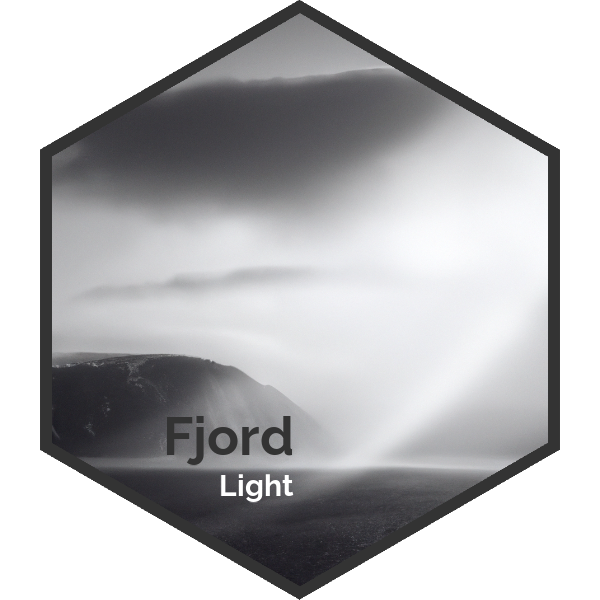

# FjordLight 

This package was created to aid in accessing the fjord PAR data products created by Bernard Gentili in collaboration with several other people. An ESSD paper currently in prep will contain more details.

To install this package please run: 

`devtools::install_github("FACE-IT-project/FjordLight")`

## Code of Conduct
  
  Please note that the FjordLight project is released with a [Contributor Code of Conduct](https://contributor-covenant.org/version/2/1/CODE_OF_CONDUCT.html). By contributing to this project, you agree to abide by its terms.
